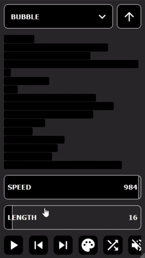

# Description

A React web app that visualises common sorting algorithms using a bar-chart.

Key Features:

- A UI that adapts well to most screen sizes, including mobile devices.
- Works when the device is offline.
- Optional sound-effects.
- Controls for pausing the sorting process and stepping forwards or backwards which is useful for learning how these algorithms work.
- The length of the bar-chart can be customised.
- The speed of the sorting process can be adjusted.

# Example 

# Where To Access

This project has been deployed on the [web](https://www.sort-viz.com/) and can be run on any device with a modern web browser. 

# Note for iOS Users

With iOS devices, the slider components don't work as expected: you can still click them, but you can't use a 'drag' gesture as one would expect from a slider.